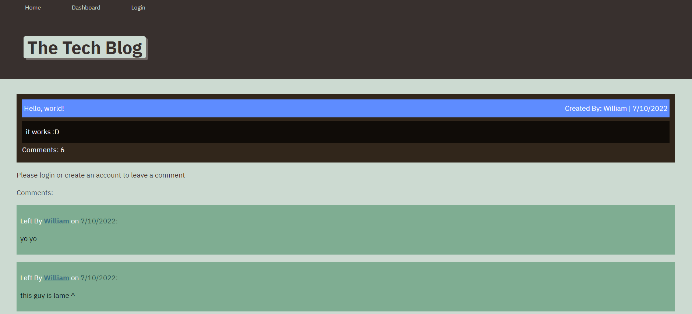

# CMS Tech Blog

This application allows you to create posts and comment on other posts to express your thoughts in the tech community.

[View deployed application here](https://cms-tech-blog-forum.herokuapp.com/)

## License
  
  
  
This application is distributed under the [MIT](https://opensource.org/licenses/MIT) license.
  ## Table of contents
  - [License](#License)
  - [About](#Usage)
  - [Contributions](#Contributions)
  - [Questions](#Questions)

  ## About
This app is community-driven. Users can make an account, log in, and immediately view our database of blog posts made by other users.

  ## Contributors
  - Johan Botes
  ## Questions
  Find me on GitHub: <https://github.com/JohanBotes>
  
Reach me by email: johan.botes@udexx.com
